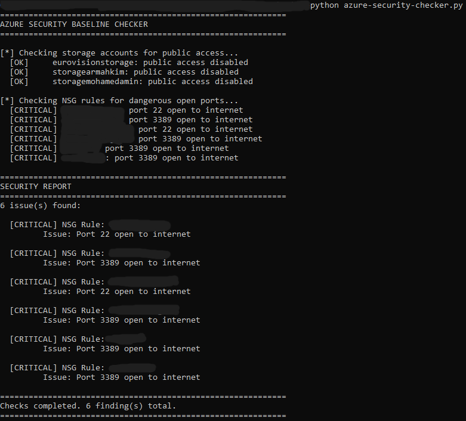

# Azure Security Baseline Checker: Automated Cloud Security Audit

> **Author:** Mohamed Amin
> **Date:** June 2026
> **Tool:** Custom Python Azure Security Baseline Checker
> **Target:** Personal Azure subscription (school project)
> **Language:** Python 3
> **Libraries:** azure-identity, azure-mgmt-storage, azure-mgmt-network

---

## What This Tool Does

An automated security audit tool that connects to an Azure subscription and
checks for common security misconfigurations. It produces a prioritized report
of findings that mirrors the kind of output a security consultant would deliver
to a client.

Two checks are currently implemented:

- Storage accounts with public blob access enabled
- NSG rules with dangerous ports open to the internet

---

## The Code

```python
from azure.identity import DefaultAzureCredential
from azure.mgmt.storage import StorageManagementClient
from azure.mgmt.network import NetworkManagementClient

SUBSCRIPTION_ID = "your-subscription-id-here"

credential = DefaultAzureCredential()
findings = []

print("=" * 60)
print("AZURE SECURITY BASELINE CHECKER")
print("=" * 60)

# CHECK 1: Storage accounts with public access
print("\n[*] Checking storage accounts for public access...")
storage_client = StorageManagementClient(credential, SUBSCRIPTION_ID)

try:
    for account in storage_client.storage_accounts.list():
        if account.allow_blob_public_access:
            findings.append({
                "severity": "HIGH",
                "resource": account.name,
                "type": "Storage Account",
                "issue": "Public blob access is enabled"
            })
            print(f"  [HIGH]   {account.name}: public blob access enabled")
        else:
            print(f"  [OK]     {account.name}: public access disabled")
except Exception as e:
    print(f"  [ERROR]  Could not check storage accounts: {e}")

# CHECK 2: NSG rules with dangerous ports open to internet
print("\n[*] Checking NSG rules for dangerous open ports...")
network_client = NetworkManagementClient(credential, SUBSCRIPTION_ID)
dangerous_ports = ["22", "3389", "23", "21"]

try:
    for nsg in network_client.network_security_groups.list_all():
        for rule in nsg.security_rules or []:
            if (
                rule.direction == "Inbound"
                and rule.access == "Allow"
                and rule.source_address_prefix in ["*", "Internet", "0.0.0.0/0"]
                and rule.destination_port_range in dangerous_ports
            ):
                findings.append({
                    "severity": "CRITICAL",
                    "resource": nsg.name,
                    "type": "NSG Rule",
                    "issue": f"Port {rule.destination_port_range} open to internet"
                })
                print(f"  [CRITICAL] {nsg.name}: port {rule.destination_port_range} open to internet")
            else:
                print(f"  [OK]     {nsg.name}: rule {rule.name} looks fine")
except Exception as e:
    print(f"  [ERROR]  Could not check NSGs: {e}")

# REPORT
print()
print("=" * 60)
print("SECURITY REPORT")
print("=" * 60)

if not findings:
    print("No issues found.")
else:
    print(f"{len(findings)} issue(s) found:\n")
    for f in findings:
        print(f"  [{f['severity']}] {f['type']}: {f['resource']}")
        print(f"         Issue: {f['issue']}")
        print()

print("=" * 60)
print(f"Checks completed. {len(findings)} finding(s) total.")
print("=" * 60)
```

---

## How It Works

**Authentication**

DefaultAzureCredential handles authentication automatically. If you are logged
in with Azure CLI via az login it uses those credentials. No passwords or tokens
need to be hardcoded in the script.

**Check 1: Storage Account Public Access**

The script calls the Azure Storage Management API and lists all storage accounts
in the subscription. For each one it checks the allow_blob_public_access
property. If True it means anyone on the internet can read files stored in that
account without any authentication. This is flagged as HIGH severity.

**Check 2: NSG Dangerous Ports**

The script calls the Azure Network Management API and lists all Network Security
Groups. For each NSG it loops through every inbound Allow rule and checks if the
source is the internet and the destination port is one of the dangerous ports
list: 22 (SSH), 3389 (RDP), 23 (Telnet), 21 (FTP). Any match is flagged as
CRITICAL because it gives the internet direct access to attack those services.

---

## Scan Results



### Storage Accounts: 3 checked, 0 issues

All three storage accounts in the subscription had public blob access disabled.
Good security posture — no files are publicly accessible without authentication.

### NSG Rules: 6 CRITICAL findings

Multiple virtual machines had port 22 (SSH) and port 3389 (RDP) open to the
entire internet via their NSG rules. This means any attacker on the internet
can attempt to connect directly to those VMs and brute force credentials or
exploit vulnerabilities in the SSH and RDP services.

This is one of the most common and dangerous misconfigurations found in Azure
environments. Many developers open these ports temporarily for convenience and
forget to close them.

---

## Severity Explanation

| Severity | Meaning |
|---|---|
| CRITICAL | Immediate risk, direct attack surface exposed to internet |
| HIGH | Significant risk, sensitive data potentially exposed |
| MEDIUM | Moderate risk, requires specific conditions to exploit |
| LOW | Minor risk, best practice violation |

---

## Connection to Security Concepts

**Shared Responsibility Model**: in IaaS (Virtual Machines) the customer is
responsible for network security including NSG rules. The open ports are not
Azure's responsibility to fix — they are the customer's misconfiguration.

**Least Privilege**: NSG rules should only allow the minimum necessary traffic.
Opening port 3389 to 0.0.0.0/0 is the opposite of Least Privilege — it allows
everyone.

**CIA Triad**: open RDP and SSH ports directly threaten Confidentiality (attacker
can read data), Integrity (attacker can modify data), and Availability (attacker
can destroy data or install ransomware).

---

## How to Run

Install dependencies:
```
pip install azure-identity azure-mgmt-storage azure-mgmt-network
```

Login to Azure:
```
az login
```

Get your subscription ID:
```
az account show
```

Add your subscription ID to the script and run:
```
python azure-security-checker.py
```

---

*Tool: custom Python Azure SDK script | Target: personal Azure subscription | Python 3*
