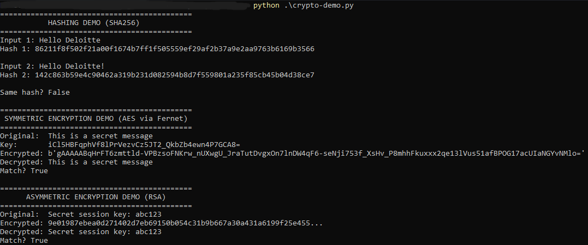

# Crypto Demo: Hashing, Symmetric and Asymmetric Encryption in Practice

> **Author:** Mohamed Amin
> **Date:** June 2026
> **Tool:** Custom Python cryptography demo
> **Language:** Python 3
> **Libraries:** hashlib (built-in), cryptography

---

## What This Demo Covers

This script demonstrates three core cryptographic concepts used in real security
systems. Each one maps directly to what happens inside TLS/HTTPS every time you
visit a secure website.

- Hashing: one way fingerprinting for integrity verification
- Symmetric encryption: fast encryption with a shared key (AES)
- Asymmetric encryption: secure key exchange using a key pair (RSA)

---

## The Code

```python
import hashlib
from cryptography.fernet import Fernet
from cryptography.hazmat.primitives.asymmetric import rsa, padding
from cryptography.hazmat.primitives import hashes

# PART 1: HASHING
print("=" * 40)
print("HASHING DEMO (SHA-256)")
print("=" * 40)

message1 = "Hello Deloitte"
message2 = "Hello Deloitte!"

hash1 = hashlib.sha256(message1.encode()).hexdigest()
hash2 = hashlib.sha256(message2.encode()).hexdigest()

print(f"Input 1: {message1}")
print(f"Hash 1:  {hash1}")
print()
print(f"Input 2: {message2}")
print(f"Hash 2:  {hash2}")
print()
print(f"Same hash? {hash1 == hash2}")
print("One character difference = completely different hash (avalanche effect)")

# PART 2: SYMMETRIC ENCRYPTION
print()
print("=" * 40)
print("SYMMETRIC ENCRYPTION DEMO (AES via Fernet)")
print("=" * 40)

key = Fernet.generate_key()
cipher = Fernet(key)

original = "This is a secret message"
encrypted = cipher.encrypt(original.encode())
decrypted = cipher.decrypt(encrypted).decode()

print(f"Original:  {original}")
print(f"Encrypted: {encrypted}")
print(f"Decrypted: {decrypted}")
print(f"Match? {original == decrypted}")

# PART 3: ASYMMETRIC ENCRYPTION
print()
print("=" * 40)
print("ASYMMETRIC ENCRYPTION DEMO (RSA)")
print("=" * 40)

private_key = rsa.generate_private_key(
    public_exponent=65537,
    key_size=2048
)
public_key = private_key.public_key()

message = "Secret session key: abc123".encode()

encrypted_rsa = public_key.encrypt(
    message,
    padding.OAEP(
        mgf=padding.MGF1(algorithm=hashes.SHA256()),
        algorithm=hashes.SHA256(),
        label=None
    )
)

decrypted_rsa = private_key.decrypt(
    encrypted_rsa,
    padding.OAEP(
        mgf=padding.MGF1(algorithm=hashes.SHA256()),
        algorithm=hashes.SHA256(),
        label=None
    )
)

print(f"Original:  {message.decode()}")
print(f"Encrypted: {encrypted_rsa.hex()[:60]}...")
print(f"Decrypted: {decrypted_rsa.decode()}")
print(f"Match? {message == decrypted_rsa}")
```

---

## Part 1: Hashing

### What hashing is

Hashing takes any input and produces a fixed length fingerprint called a hash.
It is a one way function meaning you can never reverse it to get the original
data back. The same input always produces the same hash. Change one character
and the entire hash changes completely.

### The avalanche effect



"Hello Deloitte" and "Hello Deloitte!" differ by one exclamation mark. Their
SHA-256 hashes are completely different 64 character strings. This property
is called the avalanche effect and it is what makes hashing secure.

### Real world uses

Passwords are never stored in plaintext. The system stores a hash of your
password. When you log in it hashes what you typed and compares with the stored
hash. If they match you are in. The original password is never stored anywhere.

File integrity verification works the same way. A website publishes the SHA-256
hash of a file. After downloading you run the same hash on your copy. If they
match the file was not tampered with during download.

### Hashing vs encryption

Encryption is two way. You can get the original data back with the key.
Hashing is one way. You can never get the original data back.

Use encryption for data you need to read later like a message or a file.
Use hashing for data you only need to verify like a password or a checksum.

---

## Part 2: Symmetric Encryption (AES)

### What symmetric encryption is

One key is used for both encrypting and decrypting. The same key locks and
unlocks the data. AES (Advanced Encryption Standard) is the most widely used
symmetric encryption algorithm in the world. It is what HTTPS uses to encrypt
your actual data after the TLS handshake.

### What the demo shows

A random AES key is generated. The message is encrypted into unreadable
gibberish. The same key decrypts it back to the original perfectly.

The problem with symmetric encryption: how do you securely share the key with
the other side? If someone intercepts the key they can decrypt everything.
This is solved by asymmetric encryption in Part 3.

---

## Part 3: Asymmetric Encryption (RSA)

### What asymmetric encryption is

Two mathematically linked keys are used. A public key and a private key.
What the public key encrypts only the private key can decrypt.

You share your public key with everyone. You keep your private key secret.
Anyone can send you an encrypted message using your public key. Only you can
read it because only you have the private key.

### What the demo shows

An RSA key pair is generated. The message "Secret session key: abc123" is
encrypted with the public key into unreadable hex. Only the private key can
decrypt it back to the original.

### Connection to TLS

This is exactly what happens during a TLS handshake:

```
1. Server shares its public key via its certificate
2. Client generates a random AES session key
3. Client encrypts that AES key using the server's public key
4. Server decrypts it with its private key
5. Both sides now have the same AES session key
6. All further communication uses AES for speed
```

RSA solves the key sharing problem. AES solves the speed problem. Together
they are what makes HTTPS both secure and fast.

---

## CIA Triad Mapping

Each concept in this demo maps directly to the CIA Triad:

| Concept | CIA Pillar | How |
|---|---|---|
| Hashing | Integrity | Detects if data was tampered with |
| AES encryption | Confidentiality | Makes data unreadable to unauthorized parties |
| RSA encryption | Confidentiality | Securely shares the AES key |
| All three together | Availability | Secure systems stay trusted and operational |

---

## What I Learned

Building this demo connected theory to practice. The same concepts that are
described abstractly in security frameworks like ISO 27001 and the CIA Triad
are implemented in Python in under 60 lines of code.

The key insight: TLS is not magic. It is a carefully engineered combination of
hashing, symmetric encryption, and asymmetric encryption, each solving a
specific problem that the others cannot solve alone.

---

*Tool: custom Python cryptography demo | Libraries: hashlib, cryptography | Python 3*
