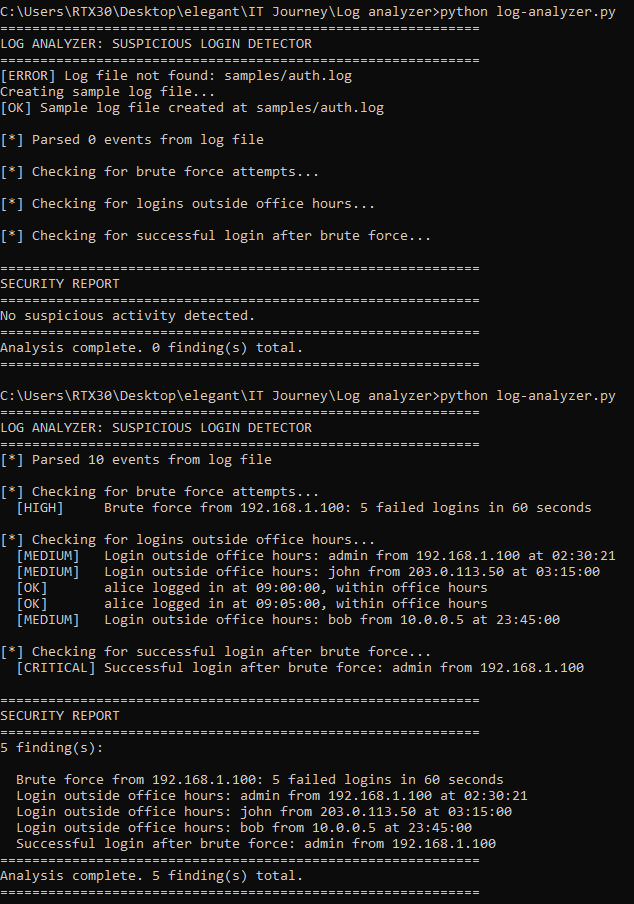

# Log Analyzer: Suspicious Login Detector

> **Author:** Mohamed Amin
> **Date:** June 2026
> **Tool:** Custom Python Log Analyzer
> **Language:** Python 3 (no external libraries)
> **Log format:** Linux auth.log (SSH login events)

---

## What This Tool Does

An automated log analysis tool that parses Linux authentication logs and
detects three common attack patterns: brute force attacks, logins outside
office hours, and successful logins following a brute force attempt.

This is a simplified version of what a SIEM does at enterprise scale. Instead
of one log file it processes millions of events per second across thousands
of systems simultaneously.

---

## The Code

```python
import re
from datetime import datetime
from collections import defaultdict
import os

LOG_FILE = "samples/auth.log"
BRUTE_FORCE_THRESHOLD = 5
BRUTE_FORCE_WINDOW = 60
OFFICE_HOURS_START = 6
OFFICE_HOURS_END = 22
```

Configuration constants at the top make the tool easy to tune. Changing the
brute force threshold from 5 to 10 requires editing one line, not hunting
through the entire script.

---

## How It Works

**Parsing**

Each log line is processed by a regular expression that extracts four fields:
timestamp, event type (Failed or Accepted password), username, and IP address.
Lines that do not match the expected format are silently skipped.

```
Jan 15 02:30:01 server sshd[1234]: Failed password for admin from 192.168.1.100 port 22 ssh2
         |                                    |              |          |
      timestamp                           event type      username    IP address
```

**Detection 1: Brute Force**

After parsing, failed login timestamps are grouped by IP address using a
defaultdict. For each IP the script checks if 5 or more failed logins occurred
within a 60 second window. If yes, it is flagged as brute force.

**Detection 2: Off-hours Logins**

Every successful login is checked against the configured office hours window
(6am to 10pm). Logins outside this window are flagged as medium severity for
investigation.

**Detection 3: Success After Brute Force**

After identifying brute force IPs, the script checks if any of those same IPs
also had a successful login. This is the most critical finding — it means the
brute force attack worked.

---

## Scan Results



```
[*] Parsed 10 events from log file

[*] Checking for brute force attempts...
  [HIGH]     Brute force from 192.168.1.100: 5 failed logins in 60 seconds

[*] Checking for logins outside office hours...
  [MEDIUM]   Login outside office hours: admin from 192.168.1.100 at 02:30:21
  [MEDIUM]   Login outside office hours: john from 203.0.113.50 at 03:15:00
  [OK]       alice logged in at 09:00:00, within office hours
  [OK]       alice logged in at 09:05:00, within office hours
  [MEDIUM]   Login outside office hours: bob from 10.0.0.5 at 23:45:00

[*] Checking for successful login after brute force...
  [CRITICAL] Successful login after brute force: admin from 192.168.1.100
```

---

## Analysis of Findings

### CRITICAL: Successful login after brute force

IP 192.168.1.100 attempted 5 failed logins in 60 seconds then successfully
authenticated as admin. This is a confirmed account compromise via brute force.
The admin account should be immediately disabled, the session terminated, and
the source IP blocked.

### HIGH: Brute force from 192.168.1.100

5 failed login attempts in 60 seconds from a single IP. This is an automated
attack trying multiple passwords rapidly. Even if it had not succeeded it would
warrant blocking the IP and investigating the source.

### MEDIUM: Logins outside office hours

Three successful logins between 10pm and 6am. The admin login at 2:30am
combined with the brute force finding is especially suspicious. The john and
bob logins could be legitimate remote work but should be verified with those
users.

### Clean: alice

Two logins during office hours from an internal IP. Normal behavior, no action
needed.

---

## Connection to SIEM

This tool implements the same detection logic used by enterprise SIEM platforms
like Microsoft Sentinel and Splunk. The difference is scale: a SIEM applies
these same rules across millions of log events per second from thousands of
systems simultaneously, with thousands of correlation rules running in parallel.

The three detections map directly to real SIEM use cases:

| Detection | SIEM Rule Type |
|---|---|
| Brute force | Threshold alert: X events in Y seconds from same source |
| Off-hours login | Time-based anomaly detection |
| Success after brute force | Correlation rule: chain of events from same IP |

---

## What I Learned

Building this tool from scratch made the SIEM concept concrete. A SIEM is not
magic — it is pattern matching and correlation applied at scale. The same logic
that detects a brute force attack in 30 lines of Python is what Splunk and
Sentinel do with thousands of rules across an entire enterprise network.

The key insight: security is about connecting dots across multiple events that
individually look harmless. One failed login is normal. Five failed logins in
60 seconds followed by a success is an incident.

---

*Tool: custom Python log analyzer | Log format: Linux auth.log | Python 3*
