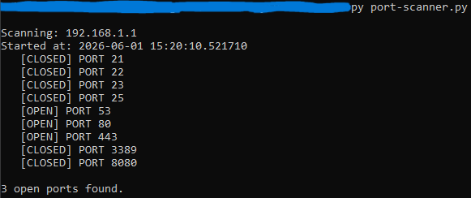

# Port Scanner: Building a TCP Port Scanner from Scratch

> **Author:** Mohamed Amin
> **Date:** June 2026
> **Tool:** Custom Python TCP Port Scanner
> **Target:** Home router
> **Language:** Python 3 (no external libraries)

---

## What is a Port Scanner?

A port scanner checks which ports are open on a target machine. Each open port
represents a service running and listening for connections. From a security
perspective open ports are potential entry points for attackers. Knowing which
ones are exposed is the first step of any network security audit.

This is exactly what tools like Nmap, Nessus, and Qualys do at their core.
They attempt connections on ports and report what is open. I built a simplified
version from scratch to understand the underlying mechanism.

---

## What I Built

A TCP port scanner using only Python's built-in socket library. No pip installs,
no external dependencies, just raw socket connections.

The scanner:
- Takes an IP address and a list of ports as input
- Attempts a TCP connection on each port
- Reports open or closed for each one
- Prints a summary at the end with timestamps

---

## The Code

```python
import socket
import sys
from datetime import datetime

def scan_port(ip, port, timeout=1):
    try:
        sock = socket.socket(socket.AF_INET, socket.SOCK_STREAM)
        sock.settimeout(timeout)
        result = sock.connect_ex((ip, port))
        sock.close()
        return result == 0
    except:
        return False

def scan_target(ip, ports):
    print(f"\nScanning {ip}")
    print(f"Started at: {datetime.now()}\n")
    
    open_ports = []
    for port in ports:
        if scan_port(ip, port):
            print(f"  [OPEN]   Port {port}")
            open_ports.append(port)
        else:
            print(f"  [closed] Port {port}")
    
    print(f"\n{len(open_ports)} open ports found.")
    return open_ports

common_ports = [21, 22, 23, 25, 53, 80, 443, 3389, 8080]
target = "192.168.1.1"  # replace with your target, only scan machines you own
scan_target(target, common_ports)
```

---

## How It Works Line by Line

**import socket** loads Python's networking toolkit. A socket is a software
object that represents one end of a network connection. Think of it as a road
between your script and another machine.

**socket.socket(socket.AF_INET, socket.SOCK_STREAM)** creates a TCP socket
using IPv4 addressing. AF_INET means IPv4, SOCK_STREAM means TCP.

**sock.settimeout(1)** tells the socket to wait maximum 1 second for a response.
Without this the script would hang forever on closed or filtered ports.

**sock.connect_ex((ip, port))** is the actual knock on the door. Returns 0 if
the connection succeeded meaning port is open, anything else means port is closed.

**return result == 0** converts the number to True or False.

**try/except** is a safety net. If anything goes wrong such as invalid IP,
network drop, or OS error, the function returns False instead of crashing.

**scan_target** is the manager function. It loops through every port, calls
scan_port for each one, prints results in real time, and returns the full list
of open ports at the end.

---

## Why Two Functions?

Separation of concerns means each function does one specific job.

scan_port checks one single port and returns True or False.
scan_target manages the whole scan, loops through all ports, and handles output.

This makes the code easier to read, easier to debug, and reusable. You could
call scan_port on its own for a single port check without running a full scan.

---

## Scan Results



```
Scanning: 192.168.1.1
Started at: 2026-06-01 15:20:10.521710

  [closed] Port 21
  [closed] Port 22
  [closed] Port 23
  [closed] Port 25
  [OPEN]   Port 53
  [OPEN]   Port 80
  [OPEN]   Port 443
  [closed] Port 3389
  [closed] Port 8080

3 open ports found.
```

---

## Analysis of Open Ports

### Port 53: DNS

The router is running a local DNS resolver. This is expected behavior. Instead
of sending every DNS query to the ISP, the router handles them locally for all
devices on the network. This improves speed and reduces external dependency.

Security note: DNS on port 53 should only be accessible internally. If exposed
to the internet it could be abused for DNS amplification attacks, a type of
DDoS where attackers send small requests that generate large responses.

### Port 80: HTTP

The router admin panel is accessible over unencrypted HTTP. This means anyone
on the same network could intercept traffic between a browser and the router
admin interface using a tool like Wireshark, which I demonstrated in the
Wireshark writeup.

Security recommendation: disable HTTP access on the router and force HTTPS only.
Never manage network equipment over unencrypted connections.

### Port 443: HTTPS

The router also exposes its admin panel over encrypted HTTPS. This is the
correct and secure way to access it. TLS encrypts the connection so credentials
and configuration changes cannot be intercepted in transit.

---

## Closed Ports Analysis

| Port | Service | Why closed is good |
|---|---|---|
| 21 | FTP | Unencrypted file transfer, closing reduces attack surface |
| 22 | SSH | No remote shell access exposed on the router |
| 23 | Telnet | Sends everything in plaintext, should never be open |
| 25 | SMTP | No email server running, correct for a home router |
| 3389 | RDP | No Windows remote desktop exposed, reduces ransomware risk |
| 8080 | HTTP alt | No alternative web interface exposed |

---

## Key Security Finding

Port 80 and port 443 are both open. The router accepts both HTTP and HTTPS
connections to its admin panel. This is a security misconfiguration. HTTP
should be disabled and all traffic forced through HTTPS only.

An attacker on the same network could perform a Man-in-the-Middle attack on
the HTTP connection and intercept router credentials if an administrator logs
in over port 80 instead of 443. This directly connects to what I observed in
the Wireshark analysis where HTTP traffic is fully readable in plaintext.

---

## Connection to TCP Knowledge

Building this scanner reinforced the TCP concepts from the Wireshark session.
When connect_ex() returns 0 it means the TCP 3-way handshake completed:

```
My script sends SYN to port 80
Router responds with SYN-ACK
My script sends ACK
connect_ex() returns 0, port is open
```

When connect_ex() returns anything other than 0 either:
- The target sent RST meaning connection refused, port closed
- No response came within 1 second meaning filtered by firewall

---

## What I Learned

Building this scanner from scratch showed how TCP connections work at the code
level. The socket library gives direct access to the OS networking stack, the
same stack that every network application uses under the hood.

The key insight: a port scanner is just a tool that tries to complete a TCP
handshake on each port and reports the result. All the complexity in enterprise
tools like Nmap comes from optimizations such as parallel scanning, OS
fingerprinting, and service detection built on top of this same fundamental concept.

---

*Tool: custom Python socket scanner | Network: Home router | Python 3*
