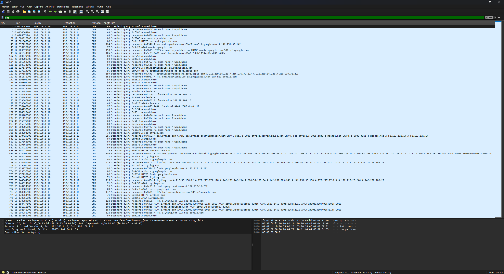
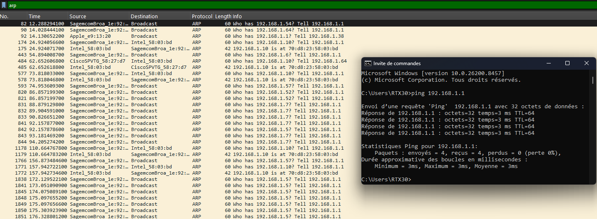
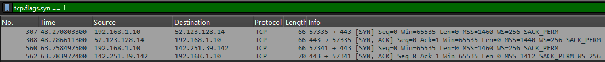
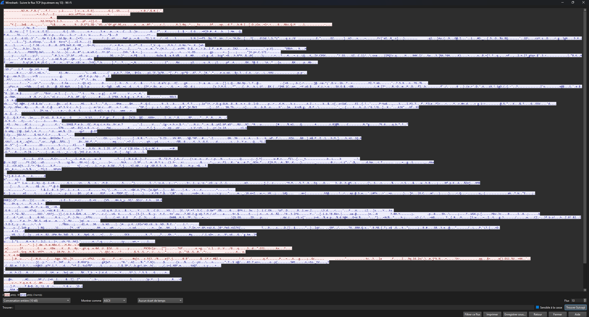
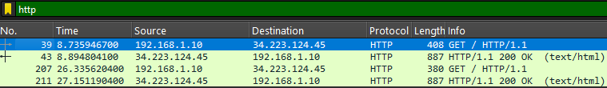
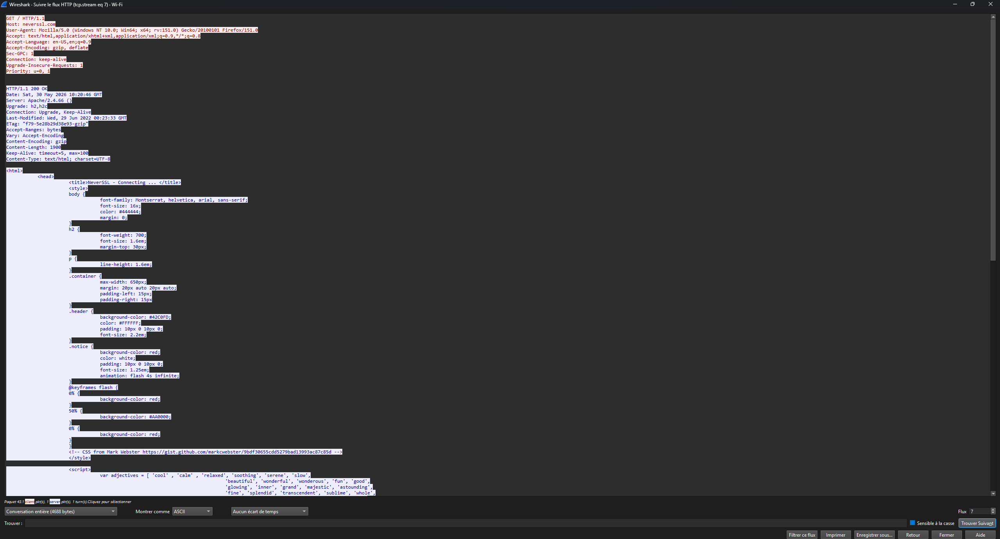
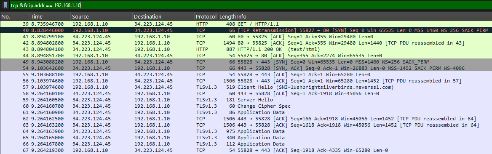
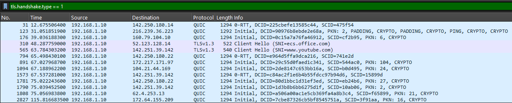

# Wireshark Network Analysis: Practical Writeup

> **Author:** Mohamed Amin
> **Date:** May 2026
> **Tools used:** Wireshark, Windows ipconfig
> **Interface captured:** Wi-Fi (192.168.1.10)

---

## What is Wireshark?

Wireshark is a network protocol analyzer. It captures every packet that travels
through your network interface in real time. It is a passive tool, meaning it
only listens and never modifies or injects traffic. Security analysts use it to
troubleshoot network issues, analyze protocols, detect suspicious behavior, and
understand how real-world communication works at a packet level.

---

## Lab Setup

Before starting the capture, I identified my active network interface using
ipconfig on Windows. My machine had multiple interfaces including several VMware
virtual adapters, a VirtualBox adapter, and a Wi-Fi interface. The correct
interface was identified as Wi-Fi because it was the only one with a default
gateway (192.168.1.1), meaning it is the only interface actually routing traffic
to the internet.

```
IP Address:      192.168.1.10
Subnet Mask:     255.255.255.0  (/24)
Default Gateway: 192.168.1.1
```

A /24 subnet means 256 addresses total: 1 network address (192.168.1.0),
1 broadcast address (192.168.1.255), and 254 usable hosts.

---

## 1. DNS Analysis

**Filter used:** `dns`

DNS (Domain Name System) translates human-readable domain names into IP
addresses. Every time you visit a website, your computer first sends a DNS
query before establishing any connection.



### What I observed

The capture immediately revealed that my machine sends DNS queries without any
user action. Background processes, browser tabs, and Windows services constantly
generate DNS traffic.

| Domain queried | What it is |
|---|---|
| `wpad.home` | Windows auto-proxy discovery repeated constantly |
| `claude.ai` | This conversation, resolved to 160.79.104.10 |
| `www.youtube.com` | Open browser tab loading in background |
| `accounts.youtube.com` | Google checking login status automatically |
| `fonts.googleapis.com` | Websites loading Google Fonts in background |
| `ecs.office.com` | Microsoft Office checking license and updates |
| `i.yting.com` | Third-party analytics and tracking domain |

### Key finding: WPAD queries

The most interesting observation was wpad.home appearing repeatedly throughout
the capture. WPAD stands for Web Proxy Auto-Discovery Protocol. Windows
automatically queries this domain to check if a proxy server exists on the
network. The router responded with "No such name" each time, meaning no proxy
is configured.

Security implication: WPAD is a known attack vector. If an attacker on the same
network sets up a rogue WPAD server, Windows will automatically route all browser
traffic through it. This is a classic Man-in-the-Middle (MITM) attack that
requires no user interaction and works completely silently.

### Key finding: DNS reveals everything

Even before any connection is established, DNS queries reveal which services a
machine is communicating with. This is why DNS logging is a critical component
of any SOC. By analyzing DNS queries alone, a security analyst can detect
malware communicating with command-and-control servers, unauthorized software
running in the background, and data exfiltration attempts.

---

## 2. ARP: Network Device Discovery

**Filter used:** `arp`

ARP (Address Resolution Protocol) operates at Layer 2 of the OSI model. It
maps IP addresses to MAC addresses within the local network. When a device wants
to communicate with another device on the same network, it broadcasts an ARP
request asking who has a specific IP address.



### Devices identified on the network

By analyzing ARP traffic passively, without sending a single packet, I identified
all devices connected to the local network.

| Device | MAC Address prefix | Type |
|---|---|---|
| Router | SagemcomBroa_1e:92:... | Sagemcom modem/router |
| My PC | Intel_58:03:bd | Intel Wi-Fi adapter |
| Apple device | Apple_e9:13:20 | iPhone or MacBook |
| TV decoder | CiscoSPVTG_58:27:d7 | Cisco set-top box |

### What ARP traffic looks like

```
Who has 192.168.1.54? Tell 192.168.1.1     -> Router asking who is at that IP
192.168.1.10 is at 70:d8:23:58:03:bd       -> My PC responding with its MAC address
```

### Security implication: ARP Spoofing

ARP has no authentication mechanism. Any device can claim to be any IP address.
An attacker can send fake ARP replies to all devices saying "I am the router."
All traffic then flows through the attacker's machine before reaching the real
router. This is ARP Spoofing and it is the foundation of most MITM attacks on
local networks.

---

## 3. TCP: The 3-Way Handshake

**Filter used:** `tcp.flags.syn == 1`

TCP (Transmission Control Protocol) operates at Layer 4 of the OSI model.
Before any data is exchanged, TCP establishes a connection using a 3-way
handshake. This is only for connection setup and no data is transferred during
the handshake itself.



### The 3-way handshake explained

| Step | Flag | Direction | Meaning |
|---|---|---|---|
| 1 | SYN | Client to Server | "I want to connect, I start at sequence 0" |
| 2 | SYN-ACK | Server to Client | "OK, I am ready, I also start at sequence 0" |
| 3 | ACK | Client to Server | "Great, connection established" |

### What I observed in Wireshark

```
Packet 307: 192.168.1.10 -> 52.123.128.14   [SYN]     Seq=0
Packet 308: 52.123.128.14 -> 192.168.1.10   [SYN,ACK] Seq=0  Ack=1
Packet 560: 192.168.1.10 -> 142.251.39.142  [SYN]     Seq=0
Packet 562: 142.251.39.142 -> 192.168.1.10  [SYN,ACK] Seq=0  Ack=1
```

### TCP stream: encrypted data in action

After the handshake completes, data transfer begins. The screenshot below shows
what a TCP stream looks like after TLS encryption is applied. The content is
completely unreadable.



### TCP Retransmission: loss detection in action

A TCP Retransmission was observed on packet 40. The original SYN was lost in
transit and the client automatically resent it without any user action.

TCP detects packet loss in two ways. First via RTO Timeout: if no ACK arrives
within the retransmission timeout the segment is resent. Second via Triple
Duplicate ACK: if the same ACK is received 3 times in a row the missing segment
is immediately retransmitted. This is called Fast Retransmit and is much faster.

---

## 4. HTTP vs HTTPS: Encryption in Practice

**Filters used:** `http` and `tls`

### HTTP: No encryption (neverssl.com)

Using http://neverssl.com, a site intentionally kept on HTTP for testing, the
request and response were fully readable in Wireshark.



The filter shows packet 39 as a GET request and packet 43 as a 200 OK response
with full HTML content. The screenshot below shows the actual HTTP stream content,
fully readable by anyone on the network.



### HTTPS: TLS encryption

The screenshot below shows the full sequence from HTTP to HTTPS on the same
capture, demonstrating both protocols side by side.



```
Packet 39:  GET / HTTP/1.1                 HTTP request fully readable
Packet 40:  [TCP Retransmission] SYN       Lost packet automatically resent
Packet 43:  HTTP/1.1 200 OK (text/html)   HTML response fully readable
Packet 49:  [SYN] to port 443             New HTTPS connection starts
Packet 54:  [SYN, ACK]                    Server responds
Packet 55:  [ACK]                         3-way handshake complete
Packet 58:  Client Hello (SNI=...)        TLS negotiation begins
Packet 59:  Server Hello                  Server selects cipher suite
Packet 60:  Change Cipher Spec            Encryption starts, nothing readable after this
```

### TLS Client Hello and SNI

**Filter used:** `tls.handshake.type == 1`



Even with HTTPS, the SNI field in the Client Hello is sent in plaintext. Your
ISP, router, and anyone on the same network can see which domains you visit.
Only the content is encrypted, not the destination.

Most traffic in the capture used QUIC instead of TLS over TCP. QUIC is a modern
protocol by Google that runs over UDP and combines transport and encryption into
a single faster handshake.

---

## 5. OSI Model: Theory Confirmed in Practice

| Layer | Name | What I saw in Wireshark |
|---|---|---|
| Layer 7 | Application | HTTP GET requests, DNS queries, TLS Client Hello |
| Layer 6 | Presentation | TLS encryption, data formatted and encrypted |
| Layer 5 | Session | TCP session management, connection open and close |
| Layer 4 | Transport | TCP (reliable) and UDP via QUIC, ports and ACKs |
| Layer 3 | Network | IP addresses routing 192.168.1.10 to external servers |
| Layer 2 | Data Link | MAC addresses in ARP: SagemcomBroa, Intel, Apple, Cisco |
| Layer 1 | Physical | Wi-Fi radio waves carrying all of the above |

---

## Key Security Takeaways

| Finding | Security Implication |
|---|---|
| WPAD queries every few seconds | Attack surface for WPAD spoofing and MITM |
| Background DNS to tracking domains | Activity visible without breaking encryption |
| ARP with no authentication | ARP spoofing possible on any local network |
| SNI visible in TLS handshake | Domain-level surveillance possible even with HTTPS |
| HTTP traffic fully readable | Never transmit sensitive data over HTTP |
| TLS 1.3 only, no older versions | Good security posture |

---

## Conclusion

This practical Wireshark session demonstrated that a significant amount of
information is visible on a network even without breaking any encryption. DNS
queries reveal which services a machine contacts. ARP traffic reveals every
device on the network. SNI fields reveal which HTTPS sites are visited. Only
the actual content of HTTPS connections remains protected.

From a SOC analyst perspective, this passive analysis provided device discovery,
service identification, protocol behavior, and multiple potential attack surfaces,
all without sending a single packet.

---

*Tools: Wireshark 4.6.6 | Interface: Wi-Fi | Network: 192.168.1.0/24*
